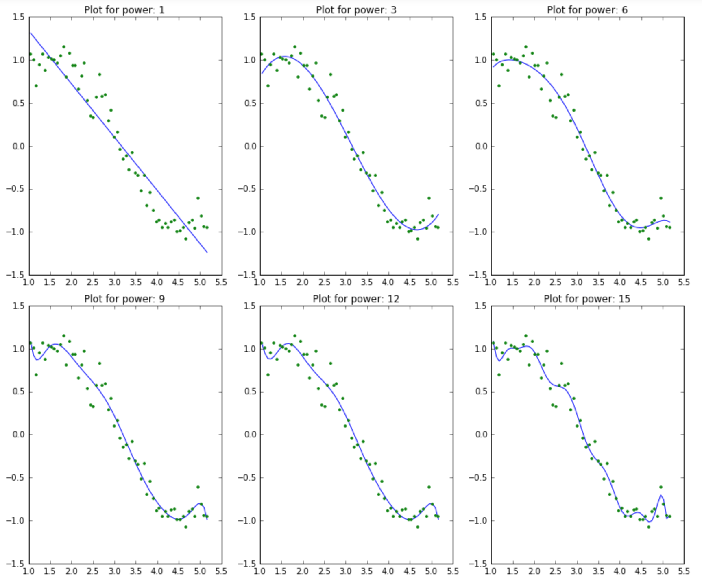
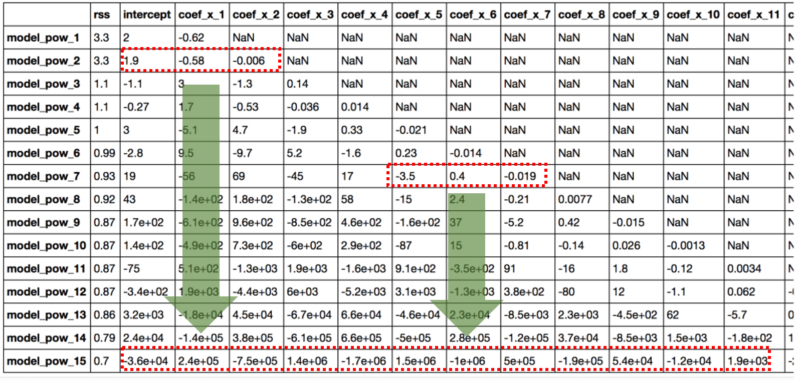
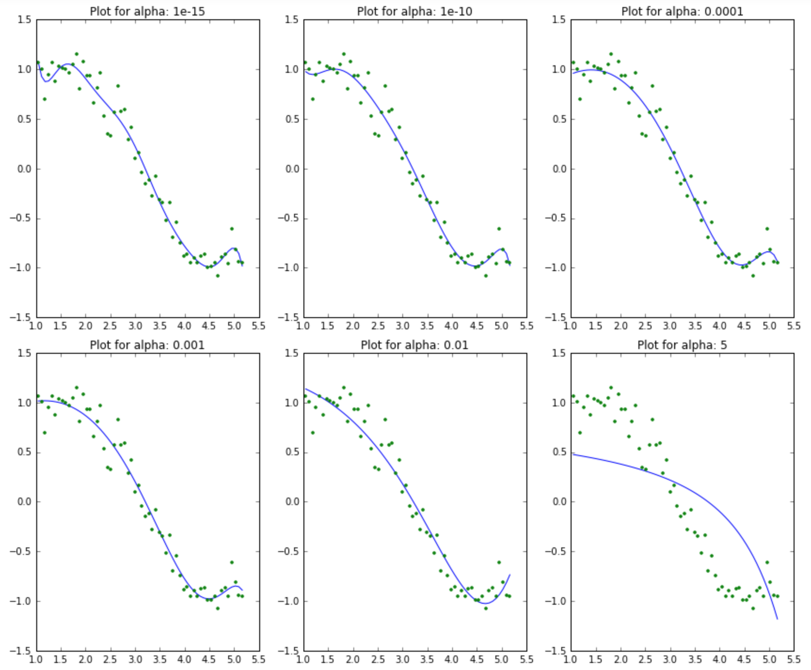
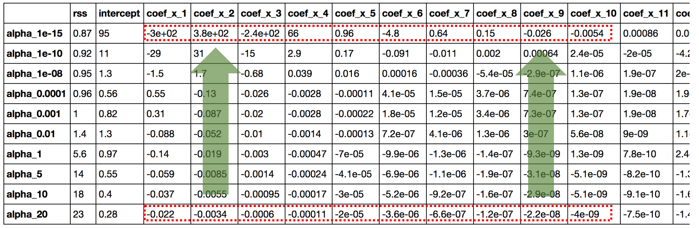
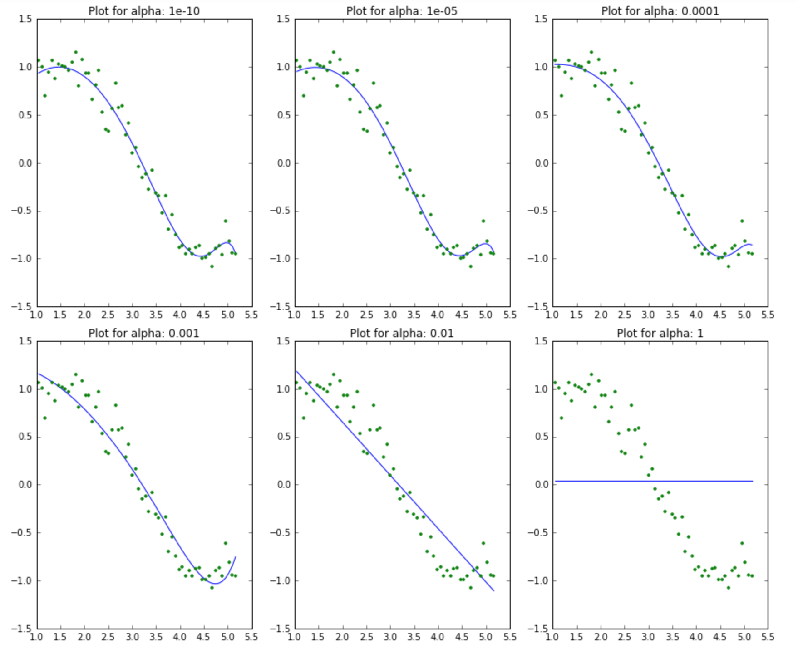
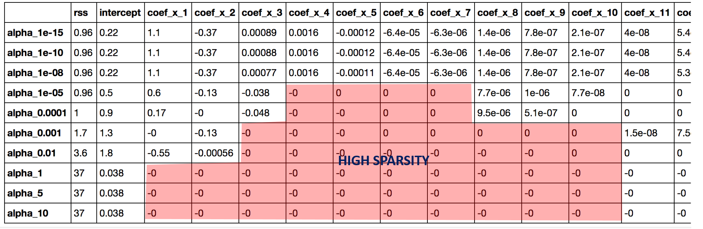

# Why Ridge and Lasso?

* Consider a case where you are building a regression model for predicting a target variable (y) using an independent variable, x. 

* Now, we will be slowly increasing the complexity of the model by adding exponential x terms to the linear regression model.

1) Initial Model:

$$  \hat y = \beta_1 x + \beta_0$$

2) Adding a Second Power Term:

$$  \hat y = \beta_1 x + \beta_2 x^2 + \beta_0$$

3) Adding a Third Power Term:

$$  \hat y = \beta_1 x + \beta_2 x^2 + \beta_3 x^3 + \beta_0$$

4) Adding an nth Power Term:

$$  \hat y = \beta_1 x + \beta_2 x^2 + \beta_3 x^3 + \ ...  \ + \beta_n x^n + \beta_0$$


## Linear Regression

* So, as explained in the premise we build a basic linear regression model by adding power terms of the independent variable x, or to put it simply, we will be increasing the model complexity



* From the above, picture it is clear that as we increase the model complexity, the model keeps fitting even very small patterns in the data

* If we think about every data point captured having a component of signal and noise, our overly complex model would be fitting the noise patterns too!

$$  Data = Signal + Noise$$

* From the below coefficients, we can see that as the number of variables increased, the coefficients have exponentially increased! This is bad!!

* We are essentially overestimating the importance of a variable



* Not just in the above toy case, but in general too, when we have many variables and we build multiple linear regression models, our regression models might overestimate the importance of variables

* So what do we do now??

## Ridge Regression

* Ridge regression is one way to solve the situation.

* When we are trying to minize our objetive function, we also try to minimize the sum of all our coefficients, in the case of ridge regression it is the squared sum of the coefficients

$$RSS(\beta) + \lambda \sum_{j=1}^{p} \beta_j^2$$

The $\alpha$ in the images below is the $\lambda$ from the above equation.  

* So, as we increase the value of lambda or the importance we give to the sum of the coefficients, our model stops fitting the noise patterns and can be better generalizable



* From the coefficients below, we can see that ridge regularization has infact helped our model from picking very large coefficients



## Lasso Regression

* Lasso is the same as before, but now we have minimize the objective function along with the sum of the absolute values of the coefficients unlike the squared sum in the case of ridge regression  

$$RSS(\beta) + \lambda \sum_{j=1}^{p} |\beta_j|$$

* We can see from the below graph that model is better generalizable as lambda increases 



* Below, we can see that as the lambda values increase the coefficients are forced to become zero



# Read and Understand the data

```{r}

labour_data <- read.csv("labour_income.csv")

str(labour_data)

summary(labour_data)

```

# Data Pre-processing

## Train-Test Split

* Split the data into train and test

```{r}

set.seed(007)

train_rows <- sample(x = seq(1, nrow(labour_data), 1), size = 0.7*nrow(labour_data))

train_data <- labour_data[train_rows, ]

test_data <- labour_data[-train_rows, ]

```

## Standardize the Data

* Standardize the continuous independent variables

```{r}

library(caret)

std_obj <- preProcess(x = train_data[, !colnames(train_data) %in% c("wages")],
                      method = c("center", "scale"))

train_std_data <- predict(std_obj, train_data)

test_std_data <- predict(std_obj, test_data)

```


## Dummify the Data

* Use the dummyVars() function from caret to convert sex and age into dummy variables

```{r}

dummy_obj <- dummyVars( ~ . , train_std_data)

train_dummy_data <- as.data.frame(predict(dummy_obj, train_std_data))

test_dummy_data <- as.data.frame(predict(dummy_obj, test_std_data))

```


## Get the data into a compatible format

* The functions we will be using today from the glmnet package expect a matrix as an input and not our familiar formula structure, so we need to convert our dataframes into a matrix

```{r}

X_train <- as.matrix(train_dummy_data[, -1])
  
y_train <- as.matrix(train_dummy_data[, 1])
  
X_test <- as.matrix(test_dummy_data[, -1])
  
y_test <- as.matrix(test_dummy_data[, 1])

```

# Hyper-parameter Tuning

* Choose an optimal lambda value for the ridge and lasso regression models by using cross validation

## Choosing a lambda for Lasso Regression

* The alpha value is 1 for lasso regression

```{r}

library(glmnet)

cv_lasso <- cv.glmnet(X_train, y_train, alpha = 1, type.measure = "mse", nfolds = 4)

plot(cv_lasso)

plot(cv_lasso$glmnet.fit, xvar="lambda", label=TRUE)

```

* The object returned form the call to cv.glmnet() function, contains the lambda values of importance

* The coefficients are accessible calling the coef() function on the cv_lasso object

```{r}

print(cv_lasso$lambda.min)

coef(cv_lasso)

```

## Choosing a lambda for Ridge Regression

* The alpha value is 0 for ridge regression

```{r}

cv_ridge <- cv.glmnet(X_train, y_train, alpha = 0, type.measure = "mse", nfolds = 4)

plot(cv_ridge)

plot(cv_ridge$glmnet.fit, xvar="lambda", label=TRUE)

```


* We can access the lambda and the coefficients as we did before

```{r}

print(cv_ridge$lambda.min)

coef(cv_ridge)

```

# Building The Final Model

* By using the optimal lambda values obtained above, we can build our ridge and lasso models

## Building the Final Lasso Regression Model

```{r}

lasso_model <- glmnet(X_train, y_train, lambda = cv_lasso$lambda.min, alpha = 1)

coef(lasso_model)

```

* Use the model to predict on test data

```{r}

preds_lasso <- predict(lasso_model, X_test)

```

## Building the Final Ridge Regression Model

```{r}

ridge_model <- glmnet(X_train, y_train, lambda = cv_ridge$lambda.min, alpha = 0)

coef(ridge_model)

```

* Use the model to predict on test data

```{r}

preds_ridge <- predict(ridge_model, X_test)

```


# Model Performance Evaluation

## Lasso Regression Model Metrics

```{r}

library(DMwR)

regr.eval(trues = y_test, preds = preds_lasso)

```

## Ridge Regression Model Metrics

```{r}

library(DMwR)

regr.eval(trues = y_test, preds = preds_ridge)

```


